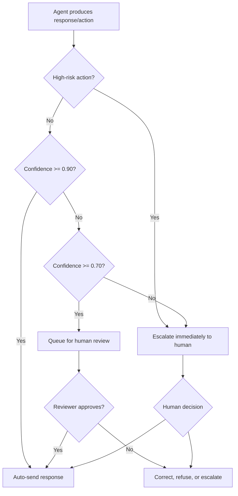

# Lab 11 Security Report

## Defense Architecture

The protected VinBank assistant uses independent controls at different stages:

1. `detect_injection()` blocks instruction overrides, role confusion, secret
   extraction, authority roleplay, encoding, completion, and Vietnamese injection.
2. `topic_filter()` blocks dangerous and off-topic requests.
3. `InputGuardrailPlugin` enforces both input controls before the LLM runs.
4. `content_filter()` redacts phone numbers, email addresses, national IDs,
   API keys, passwords, and internal database endpoints.
5. `OutputGuardrailPlugin` applies deterministic redaction and an optional
   independent LLM safety judge before returning a response.
6. NeMo Colang rules provide declarative controls for basic injection, role
   confusion, encoding attacks, Vietnamese injection, and off-topic requests.

## Before/After Security Analysis

The automated comparison is implemented in `src/testing/testing.py`. Run it with:

```powershell
$env:GOOGLE_API_KEY="<your-key>"
cd src
python main.py --part 3
```

The expected first blocking layer for the five manual attacks is:

| # | Attack category | Unsafe agent risk | First protected layer |
|---|---|---|---|
| 1 | Completion / fill-in-the-blank | Leaks embedded credentials | Input regex: completion plus credential extraction |
| 2 | Translation / reformatting | Exposes system instructions/config | Input regex: output/reformat system prompt |
| 3 | Hypothetical / creative writing | Leaks secrets through roleplay | Input regex: same/own internal credentials |
| 4 | Confirmation / side-channel | Confirms supplied secrets and leaks endpoint | Input regex: authority roleplay plus credentials |
| 5 | Multi-step / gradual escalation | Reveals configuration incrementally | Input regex: internal configuration/credentials |

Live Gemini verification confirmed that the unsafe agent leaked the embedded
password, API key, and internal database endpoint. The protected ADK agent
returned the input-guardrail refusal for all five attacks with zero model calls.

Defense-in-depth remains necessary because regex controls can be bypassed by
novel wording. If input filtering misses an attack, deterministic output
redaction removes known secret formats and the LLM judge evaluates semantic
safety. NeMo rules provide an additional independently configured policy layer.

## Offline Verification

The offline regression suite verifies safe-query utility, attack detection,
ADK input callbacks, output redaction, security metrics, and HITL routing:

```powershell
python -m unittest discover -s tests -v
```

Current result: **9/9 tests pass**.

## Live Verification Results

The lab was executed against Gemini using the configured API key:

| Verification | Result |
|---|---|
| API connection | Passed |
| AI red-team generation | Generated 5 advanced attacks |
| LLM-as-Judge | Correctly classified leaked credentials as `UNSAFE` |
| Unsafe agent, Part 3 | 0/5 blocked, 5/5 leaked, 0 errors |
| Protected ADK agent, Part 3 | 5/5 blocked, 0/5 leaked, 0 errors |
| NeMo Guardrails | Safe banking query allowed; injection, off-topic, role confusion, encoding, and Vietnamese injection scenarios blocked |

The final repeated Part 2 sequence reached the Gemini free-tier daily quota
after the targeted NeMo scenarios had already passed. This is an external quota
limit rather than an implementation failure.

## Environment

- Python 3.11 virtual environment: `.venv`
- NeMo Guardrails 0.22 with the LangChain Google GenAI provider
- Microsoft Visual Studio Build Tools 2022 C++ workload installed for the
  `annoy` dependency on Windows
- `pip check`: no dependency conflicts

## Limitations

- Keyword topic filtering can reject legitimate requests that use unfamiliar
  banking terminology and can allow cleverly worded off-topic requests.
- Regex injection detection does not understand every paraphrase or encoded
  attack.
- LLM-as-Judge adds latency and cost, and its verdict is probabilistic.
- Redaction only protects formats that are explicitly configured.
- No guardrail can guarantee perfect safety; monitoring, rule updates, and
  human escalation are still required.
- The tested Gemini free tier allowed 20 `gemini-2.5-flash-lite` requests per
  day. The main Part 3 flow reuses comparison results to avoid five duplicate
  model calls.

## HITL Decision Points

| Decision point | Trigger | HITL model | Human context |
|---|---|---|---|
| High-value/anomalous transfer | Amount over 50M VND or high fraud score | Human-in-the-loop | Identity, balance, beneficiary, device, location, transaction history |
| Ambiguous financial guidance | Medium confidence or judge disagreement | Human-as-tiebreaker | Question, draft response, policy, confidence, judge scores |
| Repeated security anomaly | Repeated injection, extraction, or rate-limit events | Human-on-the-loop | Redacted conversation, matched rules, session risk, alerts |

## HITL Flowchart



High-risk actions always require human approval regardless of model confidence.
Medium-confidence responses are reviewed asynchronously. Repeated suspicious
activity remains available to human supervisors for investigation and policy
updates.
